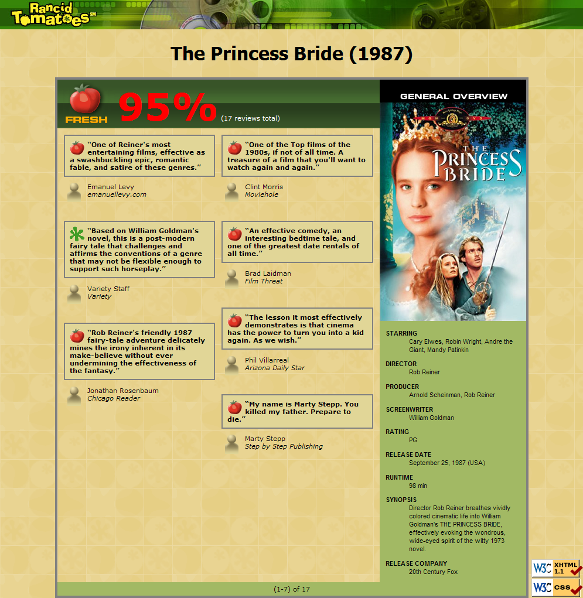

# Movie-Review-Web-Programming
A web design utilizing HTML, CSS and PHP for movie review pages. The PHP code allows new reviews to be generated for a variety of movies using the same format. All PHP code uses parameter values and should never be hard-coded for individual movie names.

# Guidelines
HTML and CSS have no validation errors.
Each movie dispalys the proper overview image, which changes based on the movie.
Webpage shows movies based on what is passed via the URL parameter.
All information is easy to read.
Each page uses the same style for information display.

# Screenshot

